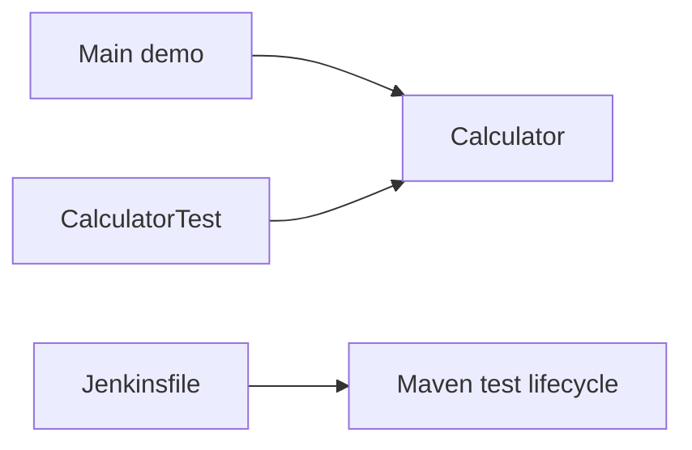

# Maven Calculator

A focused Java/Maven exercise built around a small `Calculator` class and JUnit tests. It is intentionally simple: the project is a place to practice the Maven lifecycle, unit testing, and a small Jenkins pipeline.

## Layout



The calculator currently provides integer addition, subtraction, multiplication, and division. `Main` prints a few sample operations.

## Requirements and commands

- JDK 21
- Maven 3.9+

```bash
mvn test
mvn package
```

## Current state

The goal here is a clean, testable training project. Input validation, a user-facing CLI, and decimal arithmetic are deliberately not implemented yet.
